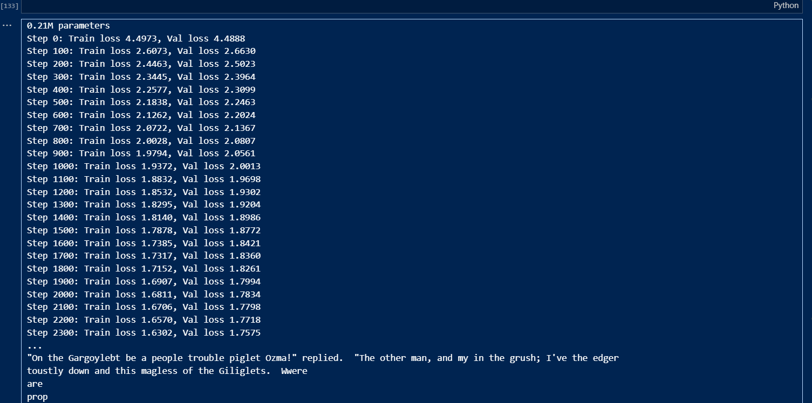

# Bigram Language Model with Transformer

## Overview

This project implements a Bigram Language Model using a Transformer architecture in PyTorch. The model is trained on the Wizard of Oz dataset to generate text sequences. The following sections provide a detailed walkthrough of the code and its components.

## Dependencies

```bash
pip install torch
```

## Code Structure

The code is organized into the following sections:

1. **Hyperparameters and Setup**
2. **Dataset Preparation**
3. **Utility Functions**
4. **Model Components**
5. **Training Loop**
6. **Text Generation**

## 1. Hyperparameters and Setup

The hyperparameters are defined at the beginning of the script for easy modification. The script also sets the device to `cuda` if a GPU is available, otherwise `cpu`.

```python
import torch
import torch.nn as nn
from torch.nn import functional as F

# Hyperparameters
batch_size = 16
block_size = 32
max_iters = 5000
eval_interval = 100
learning_rate = 1e-3
device = 'cuda' if torch.cuda.is_available() else 'cpu'
eval_iters = 200
embedding_dim = 64
num_heads = 4
num_layers = 4
dropout_rate = 0.0

# Set the random seed for reproducibility
torch.manual_seed(1337)
```

## 2. Dataset Preparation

The dataset used is The Wizard of Oz. The text is read from `wiz_of_oz.txt`, and characters are mapped to integers for processing. The data is split into training and validation sets.

```python
# Load dataset
with open('input.txt', 'r', encoding='utf-8') as f:
    text = f.read()

# Character mappings
chars = sorted(list(set(text)))
vocab_size = len(chars)
stoi = {ch: i for i, ch in enumerate(chars)}
itos = {i: ch for i, ch in enumerate(chars)}
encode = lambda s: [stoi[c] for c in s]
decode = lambda l: ''.join([itos[i] for i in l])

# Prepare train and validation splits
data = torch.tensor(encode(text), dtype=torch.long)
train_size = int(0.9 * len(data))
train_data = data[:train_size]
val_data = data[train_size:]
```

## 3. Utility Functions

### Batch Generation

A function to generate batches of data for training and evaluation.

```python
def get_batch(split):
    data = train_data if split == 'train' else val_data
    indices = torch.randint(len(data) - block_size, (batch_size,))
    x = torch.stack([data[i:i + block_size] for i in indices])
    y = torch.stack([data[i + 1:i + block_size + 1] for i in indices])
    return x.to(device), y.to(device)
```

### Loss Estimation

A function to estimate the loss on the training and validation sets.

```python
@torch.no_grad()
def estimate_loss():
    model.eval()
    losses = {'train': torch.zeros(eval_iters), 'val': torch.zeros(eval_iters)}
    for split in ['train', 'val']:
        for i in range(eval_iters):
            x, y = get_batch(split)
            logits, loss = model(x, y)
            losses[split][i] = loss.item()
    model.train()
    return {split: losses[split].mean() for split in losses}
```

## 4. Model Components

### Self-Attention Head

A single head of self-attention.

```python
class SelfAttentionHead(nn.Module):
    def __init__(self, head_size):
        super().__init__()
        self.key = nn.Linear(embedding_dim, head_size, bias=False)
        self.query = nn.Linear(embedding_dim, head_size, bias=False)
        self.value = nn.Linear(embedding_dim, head_size, bias=False)
        self.tril = torch.tril(torch.ones(block_size, block_size)).to(device)
        self.dropout = nn.Dropout(dropout_rate)

    def forward(self, x):
        batch_size, time_steps, channels = x.shape
        k = self.key(x)
        q = self.query(x)
        weights = (q @ k.transpose(-2, -1)) * (channels ** -0.5)
        weights = weights.masked_fill(self.tril[:time_steps, :time_steps] == 0, float('-inf'))
        weights = F.softmax(weights, dim=-1)
        weights = self.dropout(weights)
        v = self.value(x)
        return weights @ v
```

### Multi-Head Self-Attention

Combines multiple self-attention heads.

```python
class MultiHeadSelfAttention(nn.Module):
    def __init__(self, num_heads, head_size):
        super().__init__()
        self.heads = nn.ModuleList([SelfAttentionHead(head_size) for _ in range(num_heads)])
        self.proj = nn.Linear(embedding_dim, embedding_dim)
        self.dropout = nn.Dropout(dropout_rate)

    def forward(self, x):
        out = torch.cat([head(x) for head in self.heads], dim=-1)
        return self.dropout(self.proj(out))
```

### Feed-Forward Network

A simple feed-forward network with ReLU activation.

```python
class FeedForwardNetwork(nn.Module):
    def __init__(self, embedding_dim):
        super().__init__()
        self.net = nn.Sequential(
            nn.Linear(embedding_dim, 4 * embedding_dim),
            nn.ReLU(),
            nn.Linear(4 * embedding_dim, embedding_dim),
            nn.Dropout(dropout_rate)
        )

    def forward(self, x):
        return self.net(x)
```

### Transformer Block

Combines multi-head self-attention and feed-forward network with layer normalization.

```python
class TransformerBlock(nn.Module):
    def __init__(self, embedding_dim, num_heads):
        super().__init__()
        head_size = embedding_dim // num_heads
        self.self_attention = MultiHeadSelfAttention(num_heads, head_size)
        self.feed_forward = FeedForwardNetwork(embedding_dim)
        self.layer_norm1 = nn.LayerNorm(embedding_dim)
        self.layer_norm2 = nn.LayerNorm(embedding_dim)

    def forward(self, x):
        x = x + self.self_attention(self.layer_norm1(x))
        x = x + self.feed_forward(self.layer_norm2(x))
        return x
```

### Bigram Language Model

The main model class that integrates all components.

```python
class BigramLanguageModel(nn.Module):
    def __init__(self):
        super().__init__()
        self.token_embedding_table = nn.Embedding(vocab_size, embedding_dim)
        self.position_embedding_table = nn.Embedding(block_size, embedding_dim)
        self.transformer_blocks = nn.Sequential(*[TransformerBlock(embedding_dim, num_heads) for _ in range(num_layers)])
        self.layer_norm = nn.LayerNorm(embedding_dim)
        self.language_model_head = nn.Linear(embedding_dim, vocab_size)

    def forward(self, idx, targets=None):
        batch_size, time_steps = idx.shape
        token_embeddings = self.token_embedding_table(idx)
        position_embeddings = self.position_embedding_table(torch.arange(time_steps, device=device))
        x = token_embeddings + position_embeddings
        x = self.transformer_blocks(x)
        x = self.layer_norm(x)
        logits = self.language_model_head(x)

        if targets is None:
            return logits, None
        else:
            batch_size, time_steps, vocab_size = logits.shape
            logits = logits.view(batch_size * time_steps, vocab_size)
            targets = targets.view(batch_size * time_steps)
            loss = F.cross_entropy(logits, targets)
            return logits, loss

    def generate(self, idx, max_new_tokens):
        for _ in range(max_new_tokens):
            idx_cond = idx[:, -block_size:]
            logits, _ = self(idx_cond)
            logits = logits[:, -1, :]
            probs = F.softmax(logits, dim=-1)
            idx_next = torch.multinomial(probs, num_samples=1)
            idx = torch.cat((idx, idx_next), dim=1)
        return idx
```

## 5. Training Loop

The training loop evaluates the model periodically and updates the model parameters using backpropagation.

```python
model = BigramLanguageModel().to(device)
print(f'{sum(p.numel() for p in model.parameters()) / 1e6:.2f}M parameters')
optimizer = torch.optim.AdamW(model.parameters(), lr=learning_rate)

for iteration in range(max_iters):
    if iteration % eval_interval == 0 or iteration == max_iters - 1:
        losses = estimate_loss()
        print(f"Step {iteration}: Train loss {losses['train']:.4f}, Val loss {losses['val']:.4f}")

    x, y = get_batch('train')
    logits, loss = model(x, y)
    optimizer.zero_grad()
    loss.backward()
    optimizer.step()
```

## 6. Text Generation

Generate text using the trained model.

```python
context = torch.zeros((1, 1), dtype=torch.long, device=device)
generated_text = decode(model.generate(context, max_new_tokens=2000)[0].tolist())
print(generated_text)
```
## 7. Output



## Conclusion

This implementation of a Bigram Language Model using Transformer architecture demonstrates the process of building a language model from scratch in PyTorch. The model can be further refined and expanded for more complex tasks and larger datasets.
